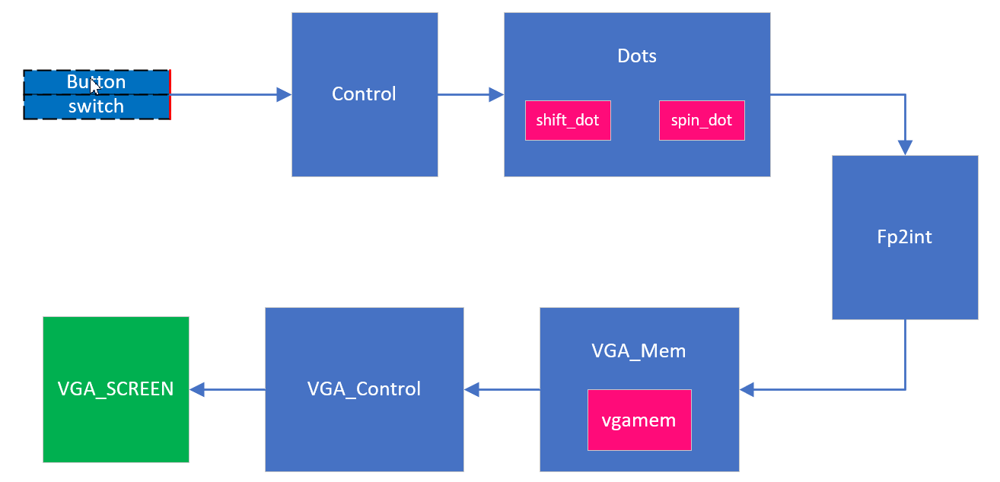

# MiniGPU

## 实现目标

使用Intel的DE10-Standard FPGA Board实现一个能够进行3维的坐标系变换的系统，并将其平行投影到屏幕上，使用显示器显示出来。我实现的demo中有5个点，其初始坐标分别(100,100,-100)  (100,-100,100)  (100,100,-100)  (100,-100,-100)  (0,0,100)。显示器上会显示这些点在x-y平面的投影，即从底部看一个四棱锥。时间原因，只实现了点的投影，面的绘制没有做。支持的变换包括坐标的平移和沿三条轴的旋转。


## 代码说明

* demo.mp4     手机拍摄的演示视频，包括坐标旋转，移动的演示。
* miniGPU.zip   quartus的工程文件
* miniGPU_src   miniGPU的源代码


## 模块架构以及说明



Control模块将会将Button和switch的信息读取后做处理并将将要进行的变换信息传送给Dots模块。

Dots模块中存放着坐标点的坐标信息，以及俩个变换的计算模块shift_dot和spin_dot。每当Control给Dots提供变换信息时，Dots会调用对应的模块。Dots中保存的是各个坐标的浮点数值。

每当Dots中进行了变换之后，将要更新VGA_Mem，这时，更新后的坐标信息会通过Fp2int模块转换为int类型的值，进入VGA_Mem更新新的投影信息。

VGA_Mem作为显存存储着各个点的信息。我将坐标系的中心放置在屏幕的中心，所以需要将点做一定偏移，然后将对应的显存修改。

VGA_Control会不断扫描并读取对应的VGA_Mem中的信息，并在屏幕上面显示出来。


## 算法描述

### 平移 

即将(x,y,z)更新为(x-n,y,z)即可实现坐标的平移。

### 旋转

沿z轴旋转时，每个点的更新如下所示
$$
x' = xcos\theta - ysin\theta\\
y' = ycos\theta + xsin\theta
$$
沿其他轴变换时，同样有对应的公式。

为了控制的简单化，我将$\theta$固定设置为10度。每当旋转按钮按下时，就会以对应的轴旋转10度。


## 代码实现和测试

我使用chisel做主体的设计，其中的浮点乘法，浮点加法，浮点数转整形使用了quartus的ip核，在测试时我使用system-verilog将其包装成C函数调用测试。

chisel实现了Control，Dots，VGA_Mem等模块。VGA_Control是使用verilog实现的，能够实现640*480分辨率的显示屏投影。在miniGPU_src中输入

```
make output/emu_top.v
```

然后将其加入到miniGPU的工程文件夹中即可。


## 视频说明

视频中演示了旋转和平移操作后的显示屏显示，黄线是x轴和y轴的投影，z轴则是垂直于显示屏。开始时其沿着z轴旋转，然后沿着x轴旋转，再进行了平移操作，这5个点的相对位置组成一个四棱锥，随着变换，点在屏幕上的投影也发生了变化。


## 按键说明

| 按钮      | 说明                                   |
| --------- | -------------------------------------- |
| sw[0]     | reset                                  |
| sw[2:1]   | 旋转的配置,0:x轴,1:y轴,2:z轴,3:不变    |
| sw[4:3]   | 平移的配置,0:左移,1:右移,2:上移,3:下移 |
| button[0] | 旋转一次                               |
| button[1] | 平移一次                               |


